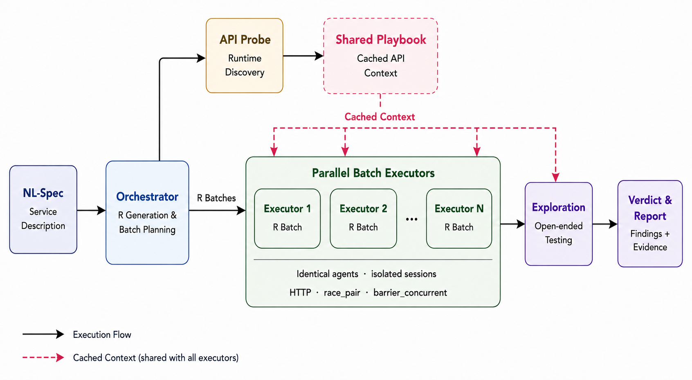

# ChaosArena

A product honorably owned by the CS 6650 Lab, Khoury College of Computer Sciences, Northeastern University.

Specification-driven multi-agent orchestration framework for black-box REST API concurrency bug detection. ChaosArena generates required test scenarios from a natural-language service description, dispatches them to parallel batch executors with barrier-synchronized concurrency tools, and produces a structured bug report.

## Layout

```
MVP/
├── agent/                        Core agent runtime
│   ├── main.py                   Unified entry point (--nl-input or --spec)
│   ├── orchestration_runner.py   Orchestrator: R generation, batch planning, dispatch
│   ├── batch_executor.py         Batch executor: runs Rs with HTTP + concurrency tools
│   ├── spec_drafter.py           NL-to-spec drafter (converts NL input to structured spec)
│   ├── spec_parser.py            Spec parser
│   ├── tools.py                  Tool definitions: http_call, race_pair, barrier_concurrent, record_event
│   ├── conversation_memory.py    Conversation memory management
│   ├── config/                   Configuration (model, region, pricing)
│   ├── prompts/                  System prompts
│   │   ├── orchestrator_system.txt
│   │   ├── api_probe_system.txt
│   │   ├── batch_executor_system.txt
│   │   └── spec_drafter_system.txt
│   ├── Verdict/                  Generated verdict reports (per run)
│   ├── trace/                    Run traces and message logs (JSON)
│   └── requirements.txt
├── specs/                        Generated and hand-written test specs
├── nl_specs/                     Natural-language service descriptions (input format)
├── target/                       Local stub servers for development
│   ├── stub_server.py            Flask stub (with BUG_MODE for demo)
│   ├── album_store_stub.py       Album store stub
│   ├── Dockerfile
│   └── requirements.txt
├── benchmark/                    Claude Code baseline prompts and reports
│   └── claude_code/
│       ├── with_spec/            Baseline runs with spec provided
│       └── without_spec/         Baseline runs without spec
└── data_results/                 Archived evaluation results
    └── results/
        ├── market/               Market service results (ChaosArena + Claude Code)
        ├── tracking/             Tracking service results
        └── user/                 User-management service results
```

## Run

### Prerequisites

```bash
cd agent
python3 -m venv .venv && .venv/bin/pip install -r requirements.txt
```

ChaosArena supports two LLM backends:

- **Bedrock** (default): set `AWS_PROFILE` and `AWS_REGION`
- **Direct API**: set `ANTHROPIC_API_KEY` and `LLM_BACKEND=direct`

### Start a target service

```bash
cd target
python3 -m venv .venv && .venv/bin/pip install -r requirements.txt
.venv/bin/python stub_server.py                # clean mode
BUG_MODE=race .venv/bin/python stub_server.py  # with deliberate race bug
```

### Run ChaosArena

```bash
# Multi-agent orchestrated evaluation (recommended for real services):
python main.py --spec ../specs/tasktracker_v2.md \
               --target http://localhost:8080 \
               --run-id my_run_001 \
               --multi-agent

# From natural-language description (drafts spec first, then evaluates):
python main.py --nl-input ../nl_specs/album_store.txt \
               --target http://localhost:8080 \
               --run-id my_run_002 \
               --multi-agent

# Single-agent mode (no orchestrator, no batch splitting):
python main.py --spec ../specs/tasktracker_v2.md \
               --target http://localhost:8080 \
               --run-id my_run_003

# Draft spec only (no evaluation):
python main.py --nl-input ../nl_specs/album_store.txt \
               --draft-only \
               --run-id album_spec_v1

# Non-interactive mode (for CI/scripting, skips all prompts):
python main.py --spec ../specs/tasktracker_v2.md \
               --target http://localhost:8080 \
               --run-id ci_run_001 \
               --multi-agent \
               --no-interactive
```

### CLI Options

| Flag | Description |
|---|---|
| `--spec <path>` | Path to an existing spec markdown file (mutually exclusive with `--nl-input`) |
| `--nl-input <path>` | Path to a natural-language service description; drafts a spec first |
| `--target <url>` | Base URL of the service under test (e.g., `http://localhost:8080`) |
| `--run-id <name>` | Name for this run; controls all output filenames (default: UTC timestamp) |
| `--multi-agent` | Use orchestrator to plan batches, run executors in parallel, aggregate verdicts |
| `--max-turns <n>` | Maximum agent turns per run (default: 60) |
| `--system-prompt <path>` | Custom batch executor system prompt file |
| `--draft-only` | Draft the spec and exit without evaluation (requires `--nl-input`) |
| `--no-interactive` | Skip all interactive prompts (spec trim, run confirmation) |

## Output

Each run produces three artifacts, all named by `--run-id`:

| File | Location | Content |
|---|---|---|
| `<run-id>_spec.md` | `specs/` | Drafted spec (only with `--nl-input`) |
| `run_<run-id>.json` | `trace/` | Full run trace: usage, per-batch costs, orchestration metadata |
| `run_<run-id>_messages.json` | `trace/` | Raw LLM message history |
| `<run-id>_verdict.md` | `Verdict/` | Final structured verdict report |

## Architecture



1. **Input**: Natural-language service description (or structured spec)
2. **Orchestrator**: Generates required scenarios (Rs) across 6 bug categories, partitions into batches
3. **API Probe**: Discovers endpoints, credentials, response shapes; produces shared playbook
4. **Shared Context**: Playbook cached as system prompt prefix for all executors
5. **Batch Executors**: Run in parallel via `ThreadPoolExecutor`, each with isolated sessions and turn budget
6. **Concurrency Tools**: `race_pair` (2-way barrier sync) and `barrier_concurrent` (N-way)
7. **Verdict Drafter**: Aggregates findings, deduplicates, emits PASS/FAIL report

## Configuration

All tuneable parameters are in [`agent/config/config.py`](agent/config/config.py).

### Environment Variables

| Variable | Description | Default |
|---|---|---|
| `LLM_BACKEND` | LLM provider: `bedrock` or `direct` | `bedrock` |
| `MODEL_ID` | Override the model ID | `us.anthropic.claude-sonnet-4-6` (Bedrock) / `claude-sonnet-4-6` (Direct) |
| `AWS_PROFILE` | AWS SSO profile (Bedrock only) | — |
| `AWS_REGION` | AWS region (Bedrock only) | `us-west-2` |
| `ANTHROPIC_API_KEY` | Anthropic API key (Direct only) | — |
| `BUG_MODE` | Stub server bug injection mode (e.g., `race`) | disabled |

### Runtime Parameters

| Parameter | Value | Description |
|---|---|---|
| `DEFAULT_MAX_TURNS` | 60 | Default turn budget per evaluation run |
| `MAX_TOKENS` | 8192 | Max output tokens per LLM call |
| `TEMPERATURE` | 0.0 | Sampling temperature (locked for reproducibility) |
| `DEFAULT_R_ESTIMATED_TURNS` | 3 | Fallback per-R turn estimate when not specified in spec |

### Pricing (2026-Q2, Sonnet 4.6)

| Token Type | Cost per 1M tokens |
|---|---|
| Input | $3.00 |
| Output | $15.00 |
| Cache creation | $3.75 |
| Cache read | $0.30 |

## License

This project is licensed under the [MIT License](LICENSE).

---

Developed by the CS 6650 Lab, Khoury College of Computer Sciences, Northeastern University.
